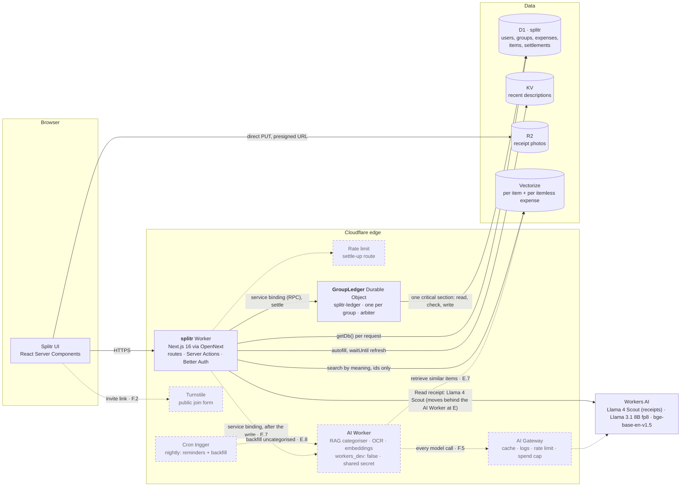
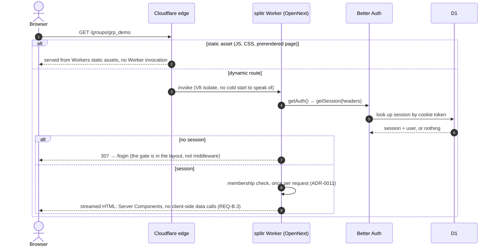
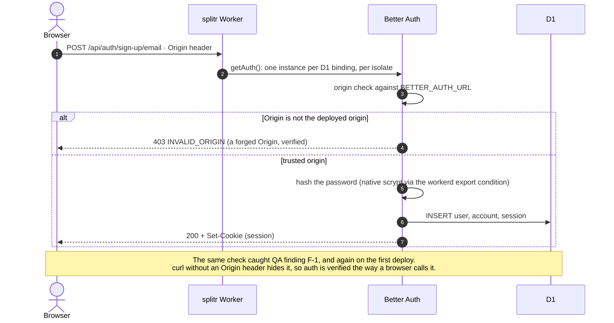
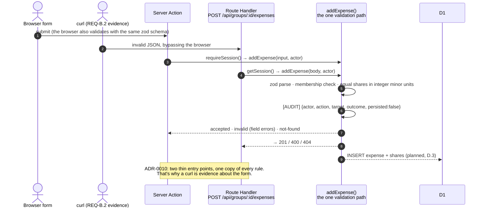
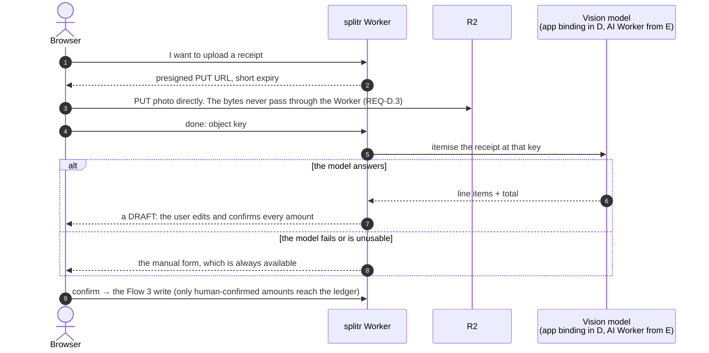
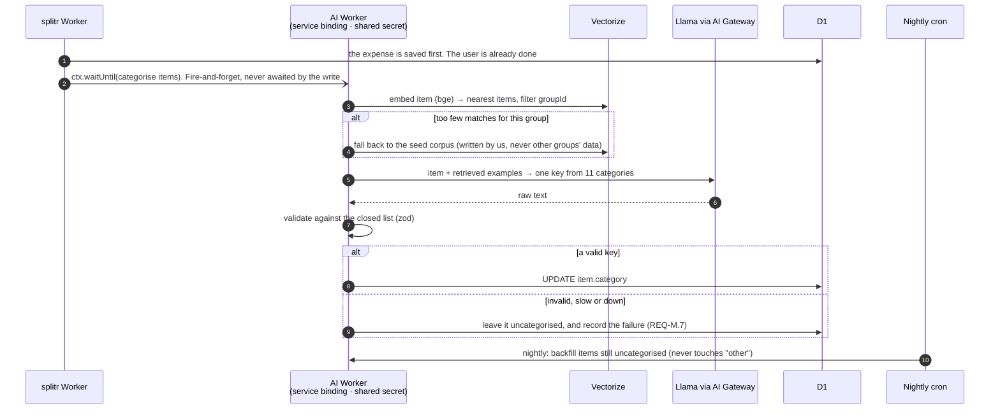
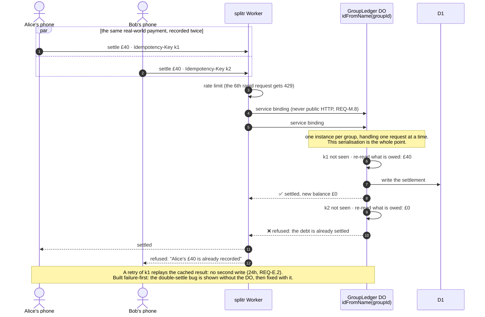
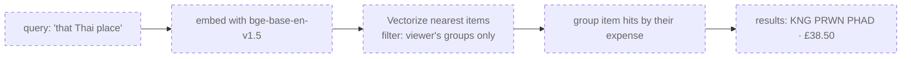
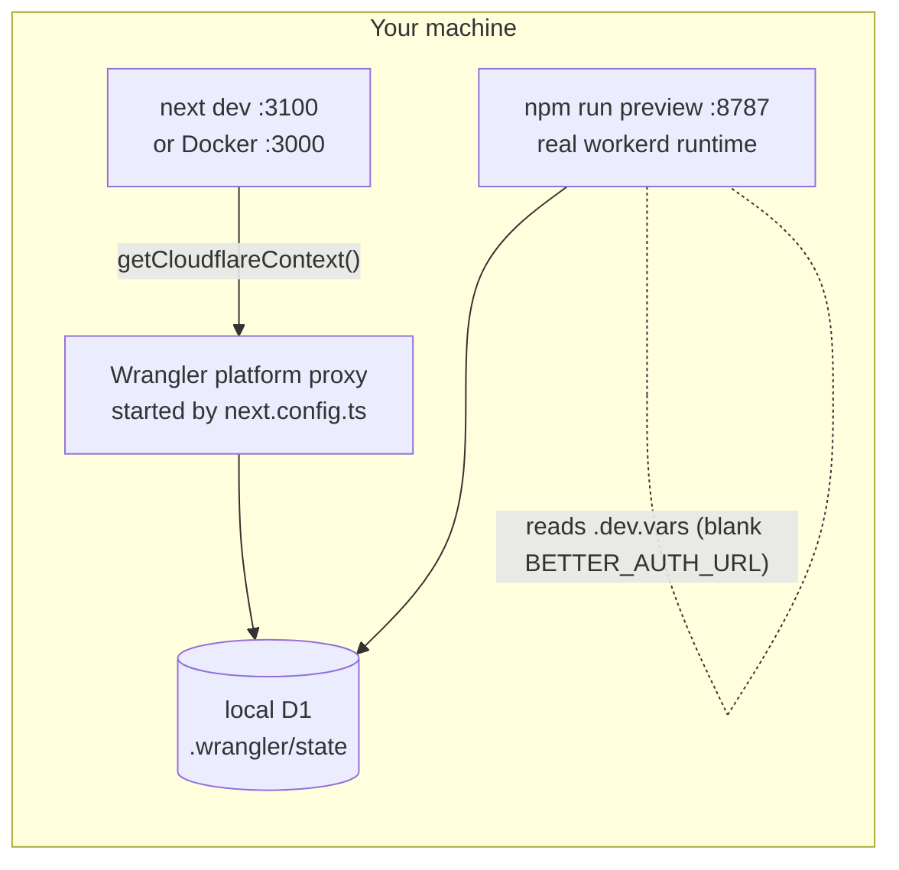

# Splitr — snap the bill

Photograph a receipt. A vision model itemises it. The group's shared balance
updates. When someone settles up, **exactly one settlement lands — never two.**

## Who it's for

Anyone splitting shared expenses with the same people repeatedly: housemates, a
group trip, a regular dinner crowd. The people who currently keep a running tally
in a chat thread and argue about it later.

## The contested write

> **Two people settling the same debt at the same moment must not both succeed —
> the second must be refused, not merged.**

Alice owes the group £40. She hands Bob cash. Alice taps *"I settled £40"* on her
phone; Bob, holding the notes, taps *"Alice settled £40"* on his. Two writes, one
real-world event. If both land, the books are wrong by £40 and nobody can tell
which entry is spurious.

This is a genuine contested write, not a last-write-wins edit:

- Both writes are **valid in isolation** — neither is stale or malformed.
- Merging is **wrong**, not merely lossy. There is no sensible union of two
  settlements of the same debt.
- The loser must be **told** it lost, because a human is standing there expecting
  the balance to move once.

A Durable Object keyed on the group (`idFromName(groupId)`) arbitrates: it
re-reads the authoritative balance, validates that the settlement does not exceed
what is actually owed, writes to D1, and returns the new balance. The second
writer arrives after the first has committed, finds the debt already cleared, and
is refused.

## Cloudflare building blocks

| Block | Use |
|---|---|
| **D1** | Users, groups, members, expenses, line items, settlements — the relational core |
| **Durable Objects** | Balance arbiter, one instance per group. This *is* the contested write |
| **R2** | Receipt photographs, uploaded direct from the client via presigned URL |
| **Workers AI** | Vision model itemises the photo; a text model categorises line items |
| **KV** | Each group's recent expense descriptions, for autofill. Never money: stale means a missing suggestion, not a wrong number ([ADR-0019](./wiki/decisions/0019-kv-holds-recent-descriptions-not-balances.md)) |
| **Cron** | Nightly settle-up reminders and uncategorised-item backfill |
| **Turnstile** | The public invite/join-group form |
| **Vectorize** | Semantic search over past expenses — *"that Thai place"*, *"the thing for the kitchen"* |

Vectorize is a deliberate **stretch feature**: a bill-splitter has no inherent
need for semantic search, so it has to earn its place. It does, because receipt
merchant strings are cryptic — `SQ *TOAST LDN` is a coffee shop, and no keyword
search will tell you that.

## How it works

A group of people who share costs (a house, a trip, a dinner crowd) uses Splitr
like this:

1. **Create a group** and share its invite link. The link opens a **public
   join page** that works without an account and is protected by Turnstile
   (`REQ-F.2`).
2. **Add an expense**, in one of two ways:
   - **by hand:** description, amount, who paid, who shared it;
   - **by snapping the receipt:** the photo uploads straight to R2, a vision
     model itemises it, and the user **reviews and confirms** the draft. The
     AI never writes an amount into the ledger by itself
     ([ADR-0016](./wiki/decisions/0016-ai-integration-strategy.md) §2).
3. **Line items are categorised automatically**, *after* the expense is saved.
   An AI Worker retrieves how *this group* categorised similar items before and
   asks Llama to pick from a closed list of 11 categories. If the AI is down,
   the item stays `uncategorised` and a nightly job fills it in. Saving never
   waits on AI.
4. **See the balance**: who owes whom, computed fresh from D1 on every view.
   It's never cached in KV, because a stale balance is a wrong balance
   ([ADR-0019](./wiki/decisions/0019-kv-holds-recent-descriptions-not-balances.md)).
   What KV *does* hold is the group's recent descriptions, for autofill.
5. **Settle up.** A Durable Object for the group accepts exactly one
   settlement of a debt and **refuses the duplicate**: the contested write
   above.
6. **Search past spending by meaning, across all your groups.** *"Getting to
   the flight"* finds *Taxi to the airport*, and *"painkillers"* finds the
   *Boots* receipt. That's 11/11 on labelled queries, against 3/11 by keyword.

## Architecture

**Legend:** solid boxes and arrows are **built and running today**. Dashed ones
are **planned**, with the build-plan step that delivers them. Everything runs
on Cloudflare's free tier. There are no servers and no containers in
production.

### System overview



| Component | What it is | Status |
|---|---|---|
| `splitr` Worker | The whole Next.js app (App Router, Server Components, Server Actions) on the Workers runtime, via `@opennextjs/cloudflare` ([ADR-0014](./wiki/decisions/0014-opennext-as-the-deploy-adapter.md)) | ✅ live at https://splitr.raffaele-digennaro.workers.dev |
| Better Auth | Email/password auth used as a black box: `getSession()` plus route gating in layouts ([ADR-0009](./wiki/decisions/0009-better-auth-on-local-sqlite-via-drizzle.md)) | ✅ live |
| D1 `splitr` | The one relational store, reached only through `getDb()` per request ([ADR-0015](./wiki/decisions/0015-one-database-driver-d1-everywhere.md)) | ✅ all 10 tables, from the first migration; groups, expenses and settlements written (D.3) |
| `GroupLedger` Durable Object | In Worker `splitr-ledger` (no public URL), reached by service binding. One per group (`idFromName`). **Arbitrates**: it reads the balances from D1, checks, and writes, all in one `blockConcurrencyWhile` critical section, plus a 24 h idempotency cache and alarm cleanup ([ADR-0023](./wiki/decisions/0023-group-ledger-arbitrates-settlements.md)) | ✅ E.1–E.6: one winner in 5/5 production rounds |
| AI Worker | A separate Worker with no public URL and a shared-secret check. Line-item categorisation by RAG, and eventually every model call | ⏳ E.7 ([ADR-0016](./wiki/decisions/0016-ai-integration-strategy.md) §6) |
| KV `splitr-hot` | Each group's last 10 expense descriptions, for autofill. A miss or a KV error falls through to D1 ([ADR-0019](./wiki/decisions/0019-kv-holds-recent-descriptions-not-balances.md)) | ✅ D.4 |
| R2 `splitr-receipts` | Receipt photos, uploaded **directly by the browser** via a 5-minute presigned PUT, and viewed through a presigned GET; only the key is stored ([ADR-0020](./wiki/decisions/0020-receipts-via-presigned-r2-urls.md)) | ✅ D.5 |
| Workers AI | **Receipt reading** with Llama 4 Scout in JSON mode: a draft whose total the user must confirm (enforced on the server) ([ADR-0021](./wiki/decisions/0021-receipt-reading-approach.md)) | ✅ D.6 (called from the app until E moves it behind the AI Worker) |
| Vectorize `splitr-search` | One `bge-base-en-v1.5` vector per line item ("item, at merchant") and one per itemless expense; ids only; searched across all your groups, and every hit re-checked in D1 ([ADR-0022](./wiki/decisions/0022-semantic-search-design.md)) | ✅ D.7/D.8: 11/11 by meaning against 3/11 by keyword |
| Cron | Nightly settle-up reminders, plus a backfill of `uncategorised` items | ⏳ E.8. Which Worker hosts `scheduled()` is decided there |
| Turnstile, rate limit, AI Gateway | Bot check on the public form; the 6th rapid settle-up gets 429; one gateway in front of every model call | ⏳ Cluster F |

### Flow 1: a page request, as deployed (built)



### Flow 2: sign-up and sign-in (built)



### Flow 3: adding an expense (built; persistence arrives at D.3)



### Flow 4: snap the bill (planned: D.5, D.6)



### Flow 5: categorising line items with RAG (planned: E.7, E.8)



The C.4 spike measured why retrieval matters: without it, the 8B model scored
**14/15 on clean descriptions but 2/10 on real receipt shorthand**
([evidence](./wiki/evidence/REQ-C.3-first-edge-llm-call.md)). The eval at E.7
decides the production model, 8B vs 70B with and without RAG
([ADR-0017](./wiki/decisions/0017-llama-3-1-8b-fp8-replaces-the-deprecated-model.md)).

### Flow 6: settling up, the contested write (planned: E.1–E.3, F.1)



### Flow 7: semantic search (planned: D.7, D.8)



Demonstrated against keyword search with about 10 labelled queries, not
anecdote (ADR-0016 §9).

### Local development (built)



One database driver everywhere (D1, locally too), so local checks are
statements about the database that's actually deployed. The Docker container
is a reproducible dev environment only. Production is V8 isolates, not
containers ([ADR-0007](./wiki/decisions/0007-docker-for-local-development.md)).

## Status

🚧 **In progress.** Built for the [Project JEDI](https://jedi.newpage.io)
TypeScript + Cloudflare learning path, across six clusters in order:

| Cluster | Topic | State |
|---|---|---|
| A | TypeScript & React fundamentals | ✅ Done |
| B | App Router, Server Components, Server Actions, zod | 🟡 5/6. `REQ-B.6` is a spoken answer |
| C | Workers, Wrangler, first edge LLM call | 🟡 4/5. **Live** at https://splitr.raffaele-digennaro.workers.dev. `REQ-C.5` is a spoken answer |
| D | D1, KV, R2, Vectorize | 🟡 5/6. D1, KV, R2, Vectorize, the schema change and receipt reading are all ✅. `REQ-D.6` is a spoken answer |
| E | Durable Objects, Cron, service bindings, RAG | 🟡 The contested write is **done**: the DO refuses the double settlement (`REQ-E.1`/`E.2`/`E.3`/`E.5`). Next: the RAG AI Worker, then the cron |
| F | Turnstile, rate limiting, AI Gateway, secret rotation | Not started |

**Everything persists in D1**, and **the contested write is closed.** Two
people settling the same debt at the same moment used to both succeed
([before](./wiki/evidence/REQ-E.1-double-settle-without-the-do.md)). Now the
group's Durable Object accepts exactly one and tells the other who got there
first ([after](./wiki/evidence/REQ-E.1-group-ledger-refuses-the-double-settlement.md)).

## Running locally

```bash
docker compose up -d     # http://localhost:3000
```

Or natively, with Node 24+:

```bash
cp .env.example .env     # then set BETTER_AUTH_SECRET
npm install
npm run cf:types         # bindings -> TypeScript; tsc fails without it
npm run db:migrate:local # apply the migrations in ./drizzle to the local D1
npx next typegen         # generate route types (RouteContext) before tsc
npm run dev -- -p 3100
# settle-up needs the ledger Worker, and categorisation the AI Worker, both
# sharing the same local D1 (the AI Worker also needs workers/ai/.dev.vars with
# AI_SHARED_SECRETS, the same value as AI_SHARED_SECRET in ./.dev.vars):
npx wrangler dev -c workers/group-ledger/wrangler.jsonc --port 8791 --persist-to .wrangler/state
npx wrangler dev -c workers/ai/wrangler.jsonc --port 8793 --persist-to .wrangler/state
```

Local dev quirk: in `next dev`, a call through a service binding blocks the
response until it returns, so saving an expense with line items takes about 1 s
longer locally than in production (measured 2026-09-25). The deployed Worker
doesn't do this.

`next dev` reaches the local D1 through Wrangler, which `next.config.ts` starts.
To run the real Workers runtime instead, use `npm run preview` (:8787). That
needs a `.dev.vars` file, described at the bottom of `.env.example`.

Deploying: `npm run deploy`. The production secret is set once with
`wrangler secret put BETTER_AUTH_SECRET`, and never in a file.

**Changing the schema:** edit `src/db/schema.ts`, then `npm run db:generate`
(writes a new migration into `./drizzle/`), `npm run db:migrate:local`, and,
once it's verified, `npm run db:migrate:remote`. **Never edit a migration that
has been applied.** Write a new one.

Any port works, including 3100 alongside the container on 3000 — nothing in the
configuration names one. Do **not** set `BETTER_AUTH_URL` locally; a loopback
value is ignored (with a warning) precisely so it cannot pin authentication to a
single port again. See
[ADR-0013](./wiki/decisions/0013-base-url-is-the-request-host-not-a-port-in-env.md).

Docker here is a reproducible **dev environment**, not a deployment artifact —
Cloudflare Workers run on V8 isolates at the edge, not in containers.

## Repo layout

```
splitr/
├── CLAUDE.md          instructions for AI agents working in this repo
├── AGENTS.md          Next.js version warning (generated by `next dev`)
├── wiki/              the knowledge base — requirements, decisions, build plan
├── docs/              course write-ups, e.g. [modules that won't run on Workers](./docs/modules-that-wont-run-on-workers.md) (`REQ-C.4`)
├── src/               the application
│   ├── app/           App Router routes: (auth), (app), api/, join/
│   ├── db/            Drizzle schema + getDb(), the only file that knows the driver
│   └── lib/           auth, session, validation schemas, services
├── workers/
│   └── group-ledger/  splitr-ledger: the GroupLedger Durable Object (no public URL) + its workerd tests
├── wrangler.jsonc     the Worker: bindings (D1), vars, compatibility date
├── open-next.config.ts  the OpenNext adapter's build config
├── Dockerfile.dev     dev container
└── docker-compose.yml local stack
```

`wiki/` is the project's memory: every requirement with its acceptance criteria,
every architectural decision with its rejected alternatives, a changelog, and an
audit log of AI-assisted work. Start at [`wiki/README.md`](./wiki/README.md).

The [build plan](./wiki/todos/build-plan.md) is the task-by-task route through
the six clusters, and the **[study guide](./wiki/todos/STUDY-GUIDE.md)** lists every
document you need to know for the demo.

## Stack

TypeScript · React · Next.js (App Router) · Tailwind · zod · Drizzle ORM ·
Cloudflare Workers, D1, KV, R2, Durable Objects, Workers AI, Vectorize, Cron,
Turnstile. Runs entirely on the Cloudflare free tier.

## Reference build

The course ships a finished reference build, EdgeLedger, cloned as a **sibling**
of this repo. It is deliberately **not** consulted during development — the
course forbids copying from it until the finishing step, and the final
deliverable is a written comparison between the two, which only exists if they
were arrived at independently. See
[ADR-0003](./wiki/decisions/0003-edgeledger-is-comparison-not-template.md).
