# Splitr — snap the bill

Photograph a receipt. A vision model itemises it. The group's shared balance
updates. When someone settles up, **exactly one settlement lands — never two.**

## Who it's for

Anyone splitting shared expenses with the same people repeatedly: housemates, a
group trip, a regular dinner crowd. The people who currently keep a running tally
in a chat thread and argue about it later.

## The contested write

> **Two people settling the same debt at the same moment must not both succeed —
> the second must be refused, not merged.**

Alice owes the group £40. She hands Bob cash. Alice taps *"I settled £40"* on her
phone; Bob, holding the notes, taps *"Alice settled £40"* on his. Two writes, one
real-world event. If both land, the books are wrong by £40 and nobody can tell
which entry is spurious.

This is a genuine contested write, not a last-write-wins edit:

- Both writes are **valid in isolation** — neither is stale or malformed.
- Merging is **wrong**, not merely lossy. There is no sensible union of two
  settlements of the same debt.
- The loser must be **told** it lost, because a human is standing there expecting
  the balance to move once.

A Durable Object keyed on the group (`idFromName(groupId)`) arbitrates: it
re-reads the authoritative balance, validates that the settlement does not exceed
what is actually owed, writes to D1, and returns the new balance. The second
writer arrives after the first has committed, finds the debt already cleared, and
is refused.

## Cloudflare building blocks

| Block | Use |
|---|---|
| **D1** | Users, groups, members, expenses, line items, settlements — the relational core |
| **Durable Objects** | Balance arbiter, one instance per group. This *is* the contested write |
| **R2** | Receipt photographs, uploaded direct from the client via presigned URL |
| **Workers AI** | Llama 4 Scout reads the receipt photo; Llama 3.1 8B categorises line items with RAG; bge embeds for search. All behind one AI Worker and AI Gateway |
| **KV** | Each group's recent expense descriptions, for autofill. Never money: stale means a missing suggestion, not a wrong number ([ADR-0019](./wiki/decisions/0019-kv-holds-recent-descriptions-not-balances.md)) |
| **Cron** | `splitr-cron` at 02:30 UTC: settle-up reminders, the uncategorised-item backfill and the search re-index. Safe to run twice |
| **Turnstile** | The public invite/join-group form, verified server-side and failing closed |
| **Vectorize** | Semantic search over past expenses — *"that Thai place"*, *"the thing for the kitchen"* |
| **Rate limiting** | Settle-up: 5 per 60 s per user, a binding backed by an exact per-user Durable Object |
| **AI Gateway** | In front of every model call: caching, logs, a rate limit; plus our own daily neuron cap |

Vectorize is a deliberate **stretch feature**: a bill-splitter has no inherent
need for semantic search, so it has to earn its place. It does, because receipt
merchant strings are cryptic — `SQ *TOAST LDN` is a coffee shop, and no keyword
search will tell you that.

## How it works

A group of people who share costs (a house, a trip, a dinner crowd) uses Splitr
like this:

1. **Create a group** and share its invite link. The link opens a **public
   join page** that works without an account and is protected by Turnstile
   (`REQ-F.2`).
2. **Add an expense**, in one of two ways:
   - **by hand:** description, amount, who paid, who shared it;
   - **by snapping the receipt:** the photo uploads straight to R2, a vision
     model itemises it, and the user **reviews and confirms** the draft. The
     AI never writes an amount into the ledger by itself
     ([ADR-0016](./wiki/decisions/0016-ai-integration-strategy.md) §2).
3. **Line items are categorised automatically**, *after* the expense is saved.
   An AI Worker retrieves how *this group* categorised similar items before and
   asks Llama to pick from a closed list of 11 categories. If the AI is down,
   the item stays `uncategorised` and a nightly job fills it in. Saving never
   waits on AI.
4. **See the balance**: who owes whom, computed fresh from D1 on every view.
   It's never cached in KV, because a stale balance is a wrong balance
   ([ADR-0019](./wiki/decisions/0019-kv-holds-recent-descriptions-not-balances.md)).
   What KV *does* hold is the group's recent descriptions, for autofill.
5. **Settle up.** A Durable Object for the group accepts exactly one
   settlement of a debt and **refuses the duplicate**: the contested write
   above.
6. **Search past spending by meaning, across all your groups.** *"Getting to
   the flight"* finds *Taxi to the airport*, and *"painkillers"* finds the
   *Boots* receipt. That's 11/11 on labelled queries, against 3/11 by keyword.

## Architecture

**As shipped (2026-09-29).** Everything below is built and running on
production. There are four Workers, and only one has a public URL. Everything
runs on Cloudflare's free tier, with no servers and no containers in
production.

### System overview

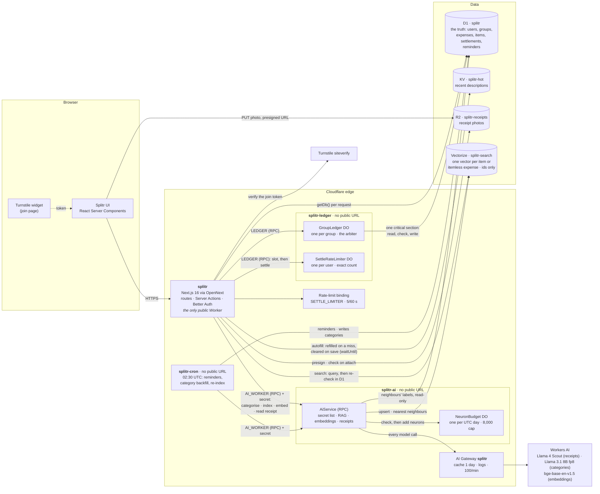
```mermaid
flowchart LR
    subgraph client["Browser"]
        UI["Splitr UI<br/>React Server Components"]
        TSW["Turnstile widget<br/>(join page)"]
    end

    subgraph edge["Cloudflare edge"]
        APP["<b>splitr</b><br/>Next.js 16 via OpenNext<br/>routes · Server Actions · Better Auth<br/><i>the only public Worker</i>"]
        RL["Rate-limit binding<br/>SETTLE_LIMITER · 5/60 s"]
        subgraph ledger["<b>splitr-ledger</b> · no public URL"]
            GL["GroupLedger DO<br/>one per group · the arbiter"]
            SRL["SettleRateLimiter DO<br/>one per user · exact count"]
        end
        subgraph ai["<b>splitr-ai</b> · no public URL"]
            AIS["AiService (RPC)<br/>secret list · RAG · embeddings · receipts"]
            NB["NeuronBudget DO<br/>one per UTC day · 8,000 cap"]
        end
        CRON["<b>splitr-cron</b> · no public URL<br/>02:30 UTC: reminders,<br/>category backfill, re-index"]
        GW["AI Gateway <b>splitr</b><br/>cache 1 day · logs · 100/min"]
    end

    subgraph data["Data"]
        D1[("D1 · splitr<br/>the truth: users, groups,<br/>expenses, items, settlements,<br/>reminders")]
        KV[("KV · splitr-hot<br/>recent descriptions")]
        R2[("R2 · splitr-receipts<br/>receipt photos")]
        VEC[("Vectorize · splitr-search<br/>one vector per item or<br/>itemless expense · ids only")]
    end

    WAI["Workers AI<br/>Llama 4 Scout (receipts) · Llama 3.1 8B fp8 (categories)<br/>bge-base-en-v1.5 (embeddings)"]
    SV["Turnstile siteverify"]

    UI -->|"HTTPS"| APP
    UI -->|"PUT photo, presigned URL"| R2
    TSW -.->|"token"| UI
    APP -->|"verify the join token"| SV
    APP -->|"getDb() per request"| D1
    APP -->|"autofill: refilled on a miss,<br/>cleared on save (waitUntil)"| KV
    APP -->|"presign · check on attach"| R2
    APP -->|"search: query, then re-check in D1"| VEC
    APP --> RL
    APP -->|"LEDGER (RPC): slot, then settle"| SRL
    APP -->|"LEDGER (RPC)"| GL
    GL -->|"one critical section:<br/>read, check, write"| D1
    APP -->|"AI_WORKER (RPC) + secret:<br/>categorise · index · embed · read receipt"| AIS
    CRON -->|"AI_WORKER (RPC) + secret"| AIS
    CRON -->|"reminders · writes categories"| D1
    AIS -->|"neighbours' labels, read-only"| D1
    AIS -->|"upsert · nearest neighbours"| VEC
    AIS -->|"check, then add neurons"| NB
    AIS -->|"every model call"| GW
    GW --> WAI
```

| Component | What it is | Decision |
|---|---|---|
| `splitr` | The whole Next.js app (App Router, Server Components, Server Actions, Better Auth) on the Workers runtime, via `@opennextjs/cloudflare`, built with webpack (55% of the 3 MiB limit). Live at https://splitr.raffaele-digennaro.workers.dev | [0014](./wiki/decisions/0014-opennext-as-the-deploy-adapter.md), [0027](./wiki/decisions/0027-webpack-production-build.md) |
| `splitr-ledger` | Two Durable Objects behind the `LedgerService` RPC entrypoint. **GroupLedger**, one per group, arbitrates settlements: it reads the balances from D1, checks and writes, all in one `blockConcurrencyWhile`, with a 24 h idempotency cache. **SettleRateLimiter**, one per user, is the exact 5-per-60-s counter behind the approximate rate-limit binding | [0023](./wiki/decisions/0023-group-ledger-arbitrates-settlements.md), [0029](./wiki/decisions/0029-settle-up-rate-limit.md) |
| `splitr-ai` | The only place Splitr calls a model. Every RPC method checks the caller's secret first, in constant time, against a **list** (which is what makes rotation possible), and logs which key matched (`key=2/2`). Every model call then goes through `metered()`: the daily neuron cap, then AI Gateway | [0025](./wiki/decisions/0025-rag-worker-eval-seed-secret-fallback.md), [0031](./wiki/decisions/0031-ai-gateway-and-neuron-cap.md), [0032](./wiki/decisions/0032-secret-rotation-drill.md) |
| `splitr-cron` | The nightly sweep at 02:30 UTC. Reminders are UPSERTed with dates, not timestamps; it backfills items still `uncategorised`, and re-indexes expenses with no `expense_indexed` row. Running it twice changes nothing | [0026](./wiki/decisions/0026-nightly-cron-worker.md) |
| AI Gateway `splitr` | In front of every model call. Text is cached for 1 day; receipt photos are never cached or logged; 100 real calls a minute (sliding); `metadata.op` on each log | [0031](./wiki/decisions/0031-ai-gateway-and-neuron-cap.md) |
| D1 `splitr` | The one relational store and the truth. Reached through `getDb()` in the app and the cron, from the ledger's critical section, and **read-only** from the AI Worker | [0015](./wiki/decisions/0015-one-database-driver-d1-everywhere.md), [0018](./wiki/decisions/0018-splitr-domain-model.md) |
| KV `splitr-hot` | Each group's last 10 descriptions, for autofill. Never money: a stale value means a missing suggestion, not a wrong number | [0019](./wiki/decisions/0019-kv-holds-recent-descriptions-not-balances.md) |
| R2 `splitr-receipts` | Receipt photos, PUT by the browser with a 5-minute presigned URL, so the bytes never pass through the Worker. Checked on attach: group prefix, size ≤ 10 MB, image type | [0020](./wiki/decisions/0020-receipts-via-presigned-r2-urls.md) |
| Vectorize `splitr-search` | `bge-base-en-v1.5` vectors ("item, at merchant"), with ids and a `groupId` only. Every hit is re-checked in D1 against the viewer's groups | [0022](./wiki/decisions/0022-semantic-search-design.md) |
| Turnstile | Managed mode, on the public `/join` page. The token is verified in the Server Action, and the check **fails closed** | [0030](./wiki/decisions/0030-turnstile-on-join.md) |
| `[AUDIT]` lines | One JSON line per mutation (`actor`, `action`, `target`, `timestamp`, `outcome`, plus `detail`), from every Worker, including Better Auth's own writes through its hooks | [0028](./wiki/decisions/0028-audit-line-format-and-coverage.md) |

**What never blocks a save (`REQ-M.7`):** categorising, indexing and the KV
refresh all run in `waitUntil`, after the response has gone. If `splitr-ai` is
down, too slow, refusing the secret or over the neuron cap:
- items stay `uncategorised`, and the cron retries them;
- search falls back to keyword, with a note;
- "Read receipt" says it couldn't, and the form stays manual.

This was shown on production during the rotation drill: 35 s of refusals, and
every save still returned 201.

### Flow 1: a page request

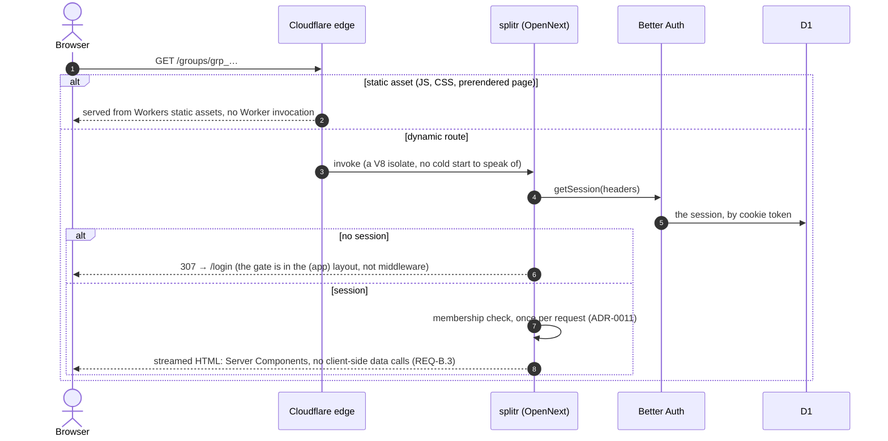
```mermaid
sequenceDiagram
    autonumber
    actor U as Browser
    participant CF as Cloudflare edge
    participant W as splitr (OpenNext)
    participant BA as Better Auth
    participant D1 as D1

    U->>CF: GET /groups/grp_…
    alt static asset (JS, CSS, prerendered page)
        CF-->>U: served from Workers static assets, no Worker invocation
    else dynamic route
        CF->>W: invoke (a V8 isolate, no cold start to speak of)
        W->>BA: getSession(headers)
        BA->>D1: the session, by cookie token
        alt no session
            W-->>U: 307 → /login (the gate is in the (app) layout, not middleware)
        else session
            W->>W: membership check, once per request (ADR-0011)
            W-->>U: streamed HTML: Server Components, no client-side data calls (REQ-B.3)
        end
    end
```

### Flow 2: sign-up and sign-in

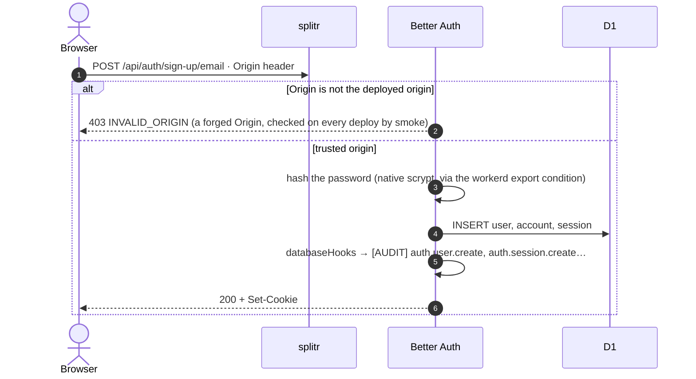
```mermaid
sequenceDiagram
    autonumber
    actor U as Browser
    participant W as splitr
    participant BA as Better Auth
    participant D1 as D1

    U->>W: POST /api/auth/sign-up/email · Origin header
    alt Origin is not the deployed origin
        BA-->>U: 403 INVALID_ORIGIN (a forged Origin, checked on every deploy by smoke)
    else trusted origin
        BA->>BA: hash the password (native scrypt, via the workerd export condition)
        BA->>D1: INSERT user, account, session
        BA->>BA: databaseHooks → [AUDIT] auth.user.create, auth.session.create…
        BA-->>U: 200 + Set-Cookie
    end
```

### Flow 3: adding an expense

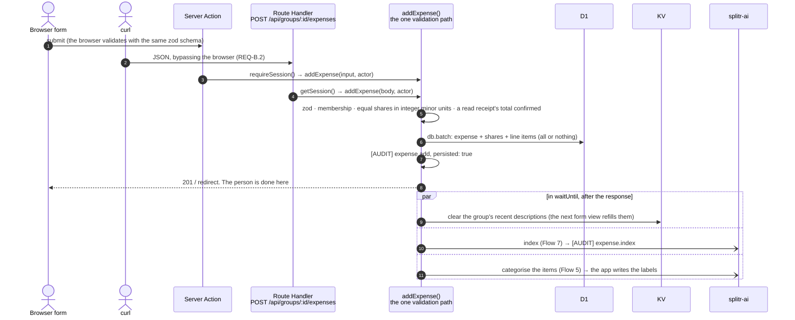
```mermaid
sequenceDiagram
    autonumber
    actor U as Browser form
    actor C as curl
    participant SA as Server Action
    participant RH as Route Handler<br/>POST /api/groups/:id/expenses
    participant S as addExpense()<br/>the one validation path
    participant D1 as D1
    participant KV as KV
    participant AIW as splitr-ai

    U->>SA: submit (the browser validates with the same zod schema)
    C->>RH: JSON, bypassing the browser (REQ-B.2)
    SA->>S: requireSession() → addExpense(input, actor)
    RH->>S: getSession() → addExpense(body, actor)
    S->>S: zod · membership · equal shares in integer minor units · a read receipt's total confirmed
    S->>D1: db.batch: expense + shares + line items (all or nothing)
    S->>S: [AUDIT] expense.add, persisted: true
    S-->>U: 201 / redirect. The person is done here
    par in waitUntil, after the response
        S->>KV: clear the group's recent descriptions (the next form view refills them)
    and
        S-)AIW: index (Flow 7) → [AUDIT] expense.index
    and
        S-)AIW: categorise the items (Flow 5) → the app writes the labels
    end
```

### Flow 4: snap the bill

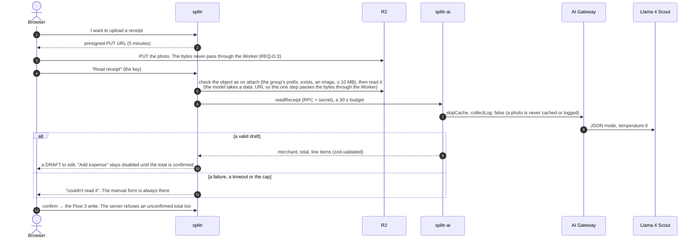
```mermaid
sequenceDiagram
    autonumber
    actor U as Browser
    participant W as splitr
    participant R2 as R2
    participant AIW as splitr-ai
    participant GW as AI Gateway
    participant L as Llama 4 Scout

    U->>W: I want to upload a receipt
    W-->>U: presigned PUT URL (5 minutes)
    U->>R2: PUT the photo. The bytes never pass through the Worker (REQ-D.3)
    U->>W: "Read receipt" (the key)
    W->>R2: check the object as on attach (the group's prefix, exists, an image, ≤ 10 MB), then read it<br/>(the model takes a data: URI, so this one step passes the bytes through the Worker)
    W->>AIW: readReceipt (RPC + secret), a 30 s budget
    AIW->>GW: skipCache, collectLog: false (a photo is never cached or logged)
    GW->>L: JSON mode, temperature 0
    alt a valid draft
        AIW-->>W: merchant, total, line items (zod-validated)
        W-->>U: a DRAFT to edit. "Add expense" stays disabled until the total is confirmed
    else a failure, a timeout or the cap
        W-->>U: "couldn't read it". The manual form is always there
    end
    U->>W: confirm → the Flow 3 write. The server refuses an unconfirmed total too
```

### Flow 5: categorising line items with RAG

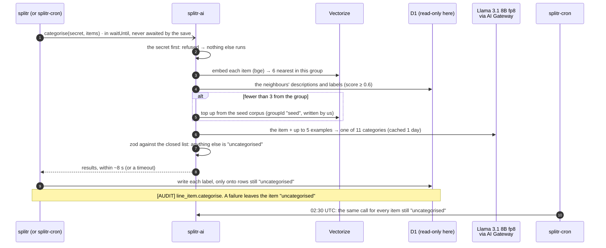
```mermaid
sequenceDiagram
    autonumber
    participant W as splitr (or splitr-cron)
    participant AIW as splitr-ai
    participant V as Vectorize
    participant D1 as D1 (read-only here)
    participant L as Llama 3.1 8B fp8<br/>via AI Gateway
    participant CR as splitr-cron

    W-)AIW: categorise(secret, items) · in waitUntil, never awaited by the save
    AIW->>AIW: the secret first: refused → nothing else runs
    AIW->>V: embed each item (bge) → 6 nearest in this group
    AIW->>D1: the neighbours' descriptions and labels (score ≥ 0.6)
    alt fewer than 3 from the group
        AIW->>V: top up from the seed corpus (groupId "seed", written by us)
    end
    AIW->>L: the item + up to 5 examples → one of 11 categories (cached 1 day)
    AIW->>AIW: zod against the closed list: anything else is "uncategorised"
    AIW-->>W: results, within ~8 s (or a timeout)
    W->>D1: write each label, only onto rows still "uncategorised"
    Note over W,D1: [AUDIT] line_item.categorise. A failure leaves the item "uncategorised"
    CR->>AIW: 02:30 UTC: the same call for every item still "uncategorised"
```

The eval picked this setup: **8B with RAG scored 28/30** on labels Raffaele
approved, against 23/30 without retrieval. Group habits went from 5/10 to 8/10,
and the 70B model did *worse* at following a group
([evidence](./wiki/evidence/REQ-E.4-rag-categorisation-eval.md)).

### Flow 6: settling up, the contested write

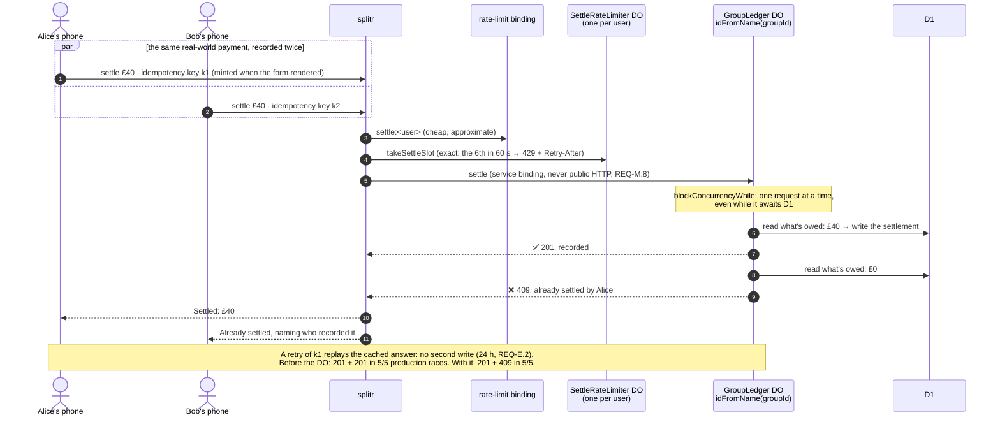
```mermaid
sequenceDiagram
    autonumber
    actor A as Alice's phone
    actor B as Bob's phone
    participant W as splitr
    participant RL as rate-limit binding
    participant SRL as SettleRateLimiter DO<br/>(one per user)
    participant DO as GroupLedger DO<br/>idFromName(groupId)
    participant D1 as D1

    par the same real-world payment, recorded twice
        A->>W: settle £40 · idempotency key k1 (minted when the form rendered)
    and
        B->>W: settle £40 · idempotency key k2
    end
    W->>RL: settle:<user> (cheap, approximate)
    W->>SRL: takeSettleSlot (exact: the 6th in 60 s → 429 + Retry-After)
    W->>DO: settle (service binding, never public HTTP, REQ-M.8)
    Note over DO: blockConcurrencyWhile: one request at a time,<br/>even while it awaits D1
    DO->>D1: read what's owed: £40 → write the settlement
    DO-->>W: ✅ 201, recorded
    DO->>D1: read what's owed: £0
    DO-->>W: ❌ 409, already settled by Alice
    W-->>A: Settled: £40
    W-->>B: Already settled, naming who recorded it
    Note over A,DO: A retry of k1 replays the cached answer: no second write (24 h, REQ-E.2).<br/>Before the DO: 201 + 201 in 5/5 production races. With it: 201 + 409 in 5/5.
```

### Flow 7: semantic search

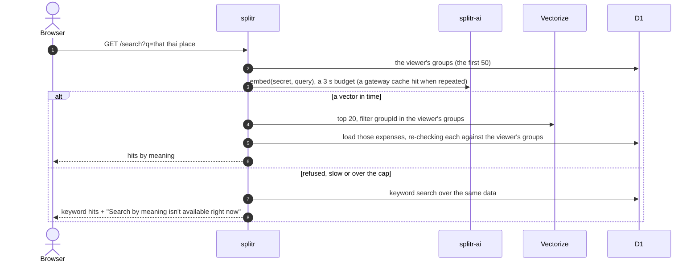
```mermaid
sequenceDiagram
    autonumber
    actor U as Browser
    participant W as splitr
    participant AIW as splitr-ai
    participant V as Vectorize
    participant D1 as D1

    U->>W: GET /search?q=that thai place
    W->>D1: the viewer's groups (the first 50)
    W->>AIW: embed(secret, query), a 3 s budget (a gateway cache hit when repeated)
    alt a vector in time
        W->>V: top 20, filter groupId in the viewer's groups
        W->>D1: load those expenses, re-checking each against the viewer's groups
        W-->>U: hits by meaning
    else refused, slow or over the cap
        W->>D1: keyword search over the same data
        W-->>U: keyword hits + "Search by meaning isn't available right now"
    end
```

Measured on 11 labelled queries: **11/11 by meaning, 3/11 by keyword**
([evidence](./wiki/evidence/REQ-D.4-semantic-search.md)).

### Flow 8: every model call

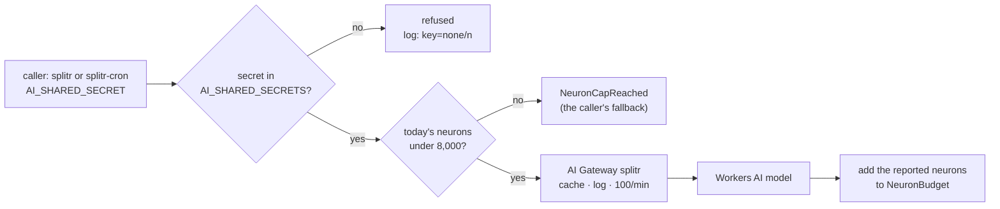
```mermaid
flowchart LR
    C["caller: splitr or splitr-cron<br/>AI_SHARED_SECRET"] --> S{"secret in<br/>AI_SHARED_SECRETS?"}
    S -- "no" --> R["refused<br/>log: key=none/n"]
    S -- "yes" --> B{"today's neurons<br/>under 8,000?"}
    B -- "no" --> X["NeuronCapReached<br/>(the caller's fallback)"]
    B -- "yes" --> G["AI Gateway splitr<br/>cache · log · 100/min"]
    G --> M["Workers AI model"]
    M --> N["add the reported neurons<br/>to NeuronBudget"]
```

- **Rotating the secret** without downtime (ADR-0032) is a matter of
  configuration, not code: put `old,new` on `splitr-ai`, move both senders to
  `new`, and retire `old` once the log shows no `key=1/2`.
- It was done on production with 0 of 187 searches falling back
  ([evidence](./wiki/evidence/REQ-F.5-secret-rotation.md)).

### Delivery

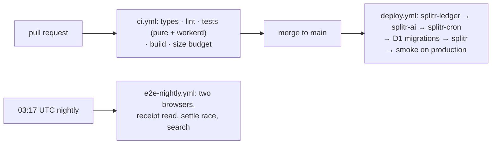
```mermaid
flowchart LR
    PR["pull request"] --> CI["ci.yml: types · lint · tests (pure + workerd)<br/>· build · size budget"]
    CI --> M["merge to main"]
    M --> D["deploy.yml: splitr-ledger → splitr-ai → splitr-cron<br/>→ D1 migrations → splitr → smoke on production"]
    N["03:17 UTC nightly"] --> E["e2e-nightly.yml: two browsers,<br/>receipt read, settle race, search"]
```

Secrets are set once by hand with `wrangler secret put`, survive deploys, and
are never in a file ([ADR-0024](./wiki/decisions/0024-ci-cd-github-actions.md)).

### Local development

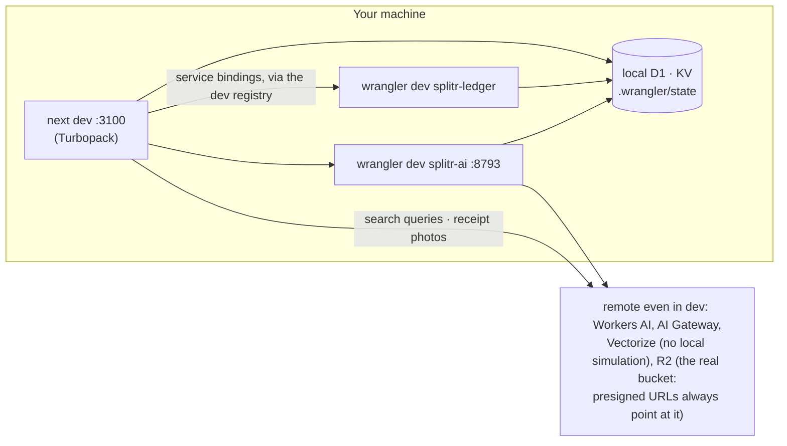
```mermaid
flowchart LR
    subgraph mac["Your machine"]
        DEV["next dev :3100<br/>(Turbopack)"]
        LED["wrangler dev splitr-ledger"]
        AIL["wrangler dev splitr-ai :8793"]
        ST[("local D1 · KV<br/>.wrangler/state")]
    end
    REM["remote even in dev: Workers AI, AI Gateway,<br/>Vectorize (no local simulation), R2 (the real bucket:<br/>presigned URLs always point at it)"]
    DEV -->|"service bindings, via the dev registry"| LED
    DEV --> AIL
    DEV --> ST
    LED --> ST
    AIL --> ST
    AIL --> REM
    DEV -->|"search queries · receipt photos"| REM
```

The same database driver runs everywhere (D1, locally too), so local checks are
statements about the database that's actually deployed. The Docker container is
a reproducible dev environment only; production is V8 isolates, not containers
([ADR-0007](./wiki/decisions/0007-docker-for-local-development.md)).

## Status

**Built and live** at https://splitr.raffaele-digennaro.workers.dev, for the
[Project JEDI](https://jedi.newpage.io) TypeScript + Cloudflare learning path,
across six clusters in order. What's left is the Finish: the notes, the
EdgeLedger comparison, and the demo.

| Cluster | Topic | State |
|---|---|---|
| A | TypeScript & React fundamentals | ✅ Done |
| B | App Router, Server Components, Server Actions, zod | ✅ Built. `REQ-B.6` is a spoken answer |
| C | Workers, Wrangler, first edge LLM call | ✅ Built and live. `REQ-C.5` is a spoken answer |
| D | D1, KV, R2, Vectorize | ✅ Built. `REQ-D.6` is a spoken answer |
| E | Durable Objects, Cron, service bindings, RAG | ✅ Built: the GroupLedger DO (one winner in 5/5 production races), the RAG AI Worker (28/30), the nightly cron (run twice: byte-identical). `REQ-E.7` is a spoken answer |
| F | Turnstile, rate limiting, AI Gateway, secret rotation | ✅ Built and met on production. `REQ-F.6` is a spoken answer |

**The contested write is closed.** Two people settling the same debt at the
same moment used to both succeed
([before](./wiki/evidence/REQ-E.1-double-settle-without-the-do.md)). Now the
group's Durable Object accepts exactly one and tells the other who got there
first ([after](./wiki/evidence/REQ-E.1-group-ledger-refuses-the-double-settlement.md)).

## Running locally

```bash
docker compose up -d     # http://localhost:3000
```

Or natively, with Node 24+:

```bash
cp .env.example .env     # then set BETTER_AUTH_SECRET
npm install
npm run cf:types         # bindings -> TypeScript; tsc fails without it
npm run db:migrate:local # apply the migrations in ./drizzle to the local D1
npx next typegen         # generate route types (RouteContext) before tsc
npm run dev -- -p 3100
# settle-up needs the ledger Worker, and categorisation the AI Worker, both
# sharing the same local D1 (the AI Worker also needs workers/ai/.dev.vars with
# AI_SHARED_SECRETS, the same value as AI_SHARED_SECRET in ./.dev.vars):
npx wrangler dev -c workers/group-ledger/wrangler.jsonc --port 8791 --persist-to .wrangler/state
npx wrangler dev -c workers/ai/wrangler.jsonc --port 8793 --persist-to .wrangler/state
```

Bundlers: `next dev` uses Turbopack, and the production build uses **webpack**
(`next build --webpack`, ADR-0027), because webpack shares chunks across Route
Handlers and keeps the Worker at 55% of the free 3 MiB instead of 83%. For an
exact local match, run `next dev --webpack`.

Local dev quirk: in `next dev`, a call through a service binding blocks the
response until it returns, so saving an expense with line items takes about 1 s
longer locally than in production (measured 2026-09-25). The deployed Worker
doesn't do this.

`next dev` reaches the local D1 through Wrangler, which `next.config.ts` starts.
To run the real Workers runtime instead, use `npm run preview` (:8787). That
needs a `.dev.vars` file, described at the bottom of `.env.example`.

Deploying: `npm run deploy`. The production secret is set once with
`wrangler secret put BETTER_AUTH_SECRET`, and never in a file.

**Changing the schema:** edit `src/db/schema.ts`, then `npm run db:generate`
(writes a new migration into `./drizzle/`), `npm run db:migrate:local`, and,
once it's verified, `npm run db:migrate:remote`. **Never edit a migration that
has been applied.** Write a new one.

Any port works, including 3100 alongside the container on 3000 — nothing in the
configuration names one. Do **not** set `BETTER_AUTH_URL` locally; a loopback
value is ignored (with a warning) precisely so it cannot pin authentication to a
single port again. See
[ADR-0013](./wiki/decisions/0013-base-url-is-the-request-host-not-a-port-in-env.md).

Docker here is a reproducible **dev environment**, not a deployment artifact —
Cloudflare Workers run on V8 isolates at the edge, not in containers.

## Repo layout

```
splitr/
├── CLAUDE.md          instructions for AI agents working in this repo
├── AGENTS.md          Next.js version warning (generated by `next dev`)
├── wiki/              the knowledge base — requirements, decisions, build plan
├── docs/              course write-ups, e.g. [modules that won't run on Workers](./docs/modules-that-wont-run-on-workers.md) (`REQ-C.4`)
├── src/               the application
│   ├── app/           App Router routes: (auth), (app), api/, join/
│   ├── db/            Drizzle schema + getDb(), the only file that knows the driver
│   └── lib/           auth, session, validation schemas, services
├── workers/
│   ├── group-ledger/  splitr-ledger: the GroupLedger and SettleRateLimiter DOs (no public URL) + workerd tests
│   ├── ai/            splitr-ai: every model call, the secret check, the NeuronBudget DO (no public URL)
│   └── cron/          splitr-cron: the nightly sweep (no public URL)
├── scripts/           verify/ (smoke, race, E2E, rate limit, Turnstile, audit, rotation drill), categorise/ (the eval), ci/
├── .github/workflows/ ci.yml (every PR), deploy.yml (every merge), e2e-nightly.yml
├── wrangler.jsonc     the app Worker: bindings, vars, compatibility date
├── open-next.config.ts  the OpenNext adapter's build config
├── Dockerfile.dev     dev container
└── docker-compose.yml local stack
```

`wiki/` is the project's memory: every requirement with its acceptance criteria,
every architectural decision with its rejected alternatives, a changelog, and an
audit log of AI-assisted work. Start at [`wiki/README.md`](./wiki/README.md).

The [build plan](./wiki/todos/build-plan.md) is the task-by-task route through
the six clusters, and the **[study guide](./wiki/todos/STUDY-GUIDE.md)** lists every
document you need to know for the demo.

## Stack

TypeScript · React · Next.js (App Router) · Tailwind · zod · Drizzle ORM ·
Cloudflare Workers, D1, KV, R2, Durable Objects, Workers AI, AI Gateway,
Vectorize, Cron, Turnstile, rate limiting. GitHub Actions for CI/CD. Runs
entirely on the Cloudflare free tier.

## Reference build

The course ships a finished reference build, EdgeLedger, cloned as a **sibling**
of this repo. It is deliberately **not** consulted during development — the
course forbids copying from it until the finishing step, and the final
deliverable is a written comparison between the two, which only exists if they
were arrived at independently. See
[ADR-0003](./wiki/decisions/0003-edgeledger-is-comparison-not-template.md).
